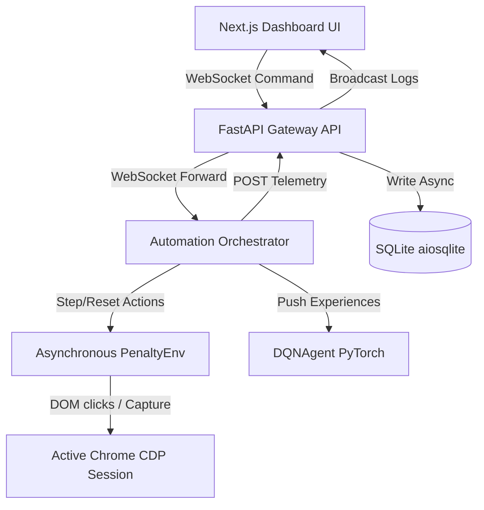

# Penalty Shootout Reinforcement Learning Bot

An AI-driven browser automation bot that plays a web-based Penalty shootout game, trains a Deep Q-Network (DQN) agent inside a custom Gymnasium environment, logs telemetry asynchronously to a local SQLite database, and streams real-time updates and screenshots to a responsive Next.js dashboard.

---

## System Architecture & How We Built It

The system is designed with four fully integrated, async-ready layers:
1. **AI Brain (`automation/rl/`)**: A PyTorch-based Double DQN agent that reads the 13-dimensional game state (12 targets grid + active payout multiplier) and predicts the optimal shootout spot (0-11) using an $\epsilon$-greedy exploration strategy. It conforms to OpenAI Gymnasium conventions.
2. **Asynchronous Database Pipeline (`backend/app/`)**: Built using FastAPI and SQLModel. It uses `sqlalchemy.ext.asyncio` and `aiosqlite` to log training rounds asynchronously, preventing file-writing blockages from locking up API requests.
3. **Playwright Automation Client (`automation/browser/`)**: An async Playwright script that hooks into an active Chrome session, reads the game board layout, coordinates grid clicks, captures viewport screenshots, and includes a `pause_for_login` mechanism allowing manual account authentication.
4. **Interactive Dashboard UI (`frontend/`)**: Built with Next.js and Tailwind CSS. Connects to `ws://localhost:8000/ws/dashboard` to render Recharts win-rate trends, policy Q-value heatmaps, scraper status logs, and live browser viewports.



---

## Technical Stack
* **Reinforcement Learning**: PyTorch, Gymnasium, NumPy
* **Automation**: Playwright (Async Chrome CDP)
* **API Gateway & Database**: FastAPI, Uvicorn, SQLModel, SQLAlchemy AsyncIO, aiosqlite
* **Dashboard Front-end**: Next.js (React), TypeScript, Tailwind CSS, Recharts, Lucide React

---

## How to Run the Project

### 1. Launch Chrome CDP Debug Port
Close all Google Chrome windows, then launch a fresh Chrome session with remote debugging enabled:
```powershell
& "C:\Program Files\Google\Chrome\Application\chrome.exe" --remote-debugging-port=9222 --user-data-dir="C:\chrome-automation-profile"
```
Log into your demo account on the target Penalty game site.

### 2. Start the Backend API
Navigate to the `backend/` directory:
```bash
# Activate virtual environment
.\venv\Scripts\activate
# Start Uvicorn backend
uvicorn app.main:app --reload
```

### 3. Run the Automation Scraper & RL Training
Navigate to the `automation/` directory:
```bash
# Activate virtual environment
.\venv\Scripts\activate
# Start orchestrator training
python main.py
```
*(The terminal will display instructions to verify manual account authentication in Chrome before handoff is triggered.)*

### 4. Run the Web Dashboard Portal
Navigate to the `frontend/` directory:
```bash
npm install
npm run dev
```
Open `http://localhost:3000` to control the training runs, adjust bet sizing and delays, and observe the agent's strategy heatmap live.
